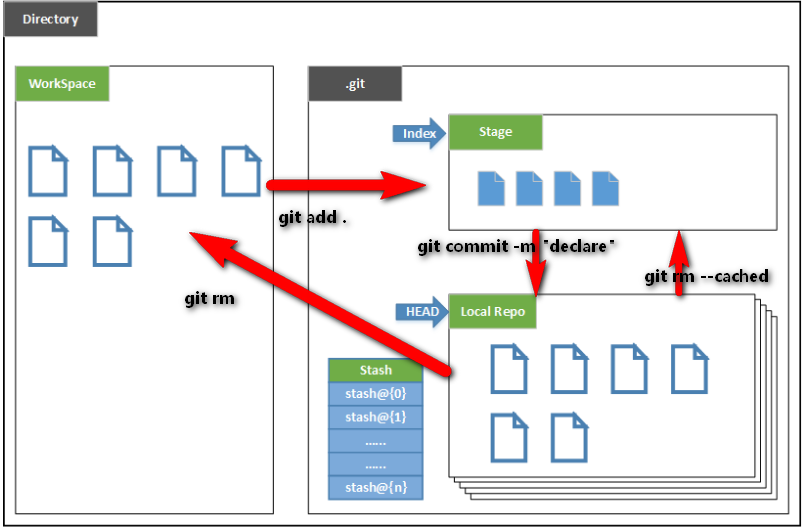
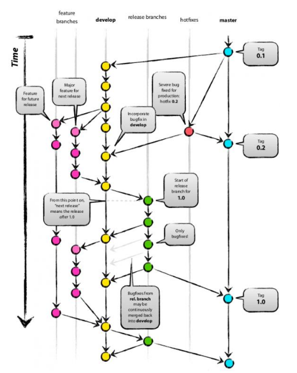

## 目录
#### 1.[Git简介](#1)
#### 2.[Git下载](#2)
#### 3.[Git配置](#3)
#### 4.[GitHub简介](#4)
#### 5.[Github注册](#5)
#### 6.[建立本地仓库](#6)
#### 7.[本地仓库与远程仓库的关联](#7)
#### 8.[本地仓库与远程仓库的同步](#8)
#### 9.[Git版本管理](#9)
#### 10.[Git分支管理](#10)
#### 11.[GitHub社区一些操作的简介](#11)
---------------------------------------
<h4 id=1>1.Git简介</h4>

>Git是一个开源的分布式版本控制系统，可以有效、高速的处理从很小到非常大的项目版本管理。Git 是 Linus Torvalds 为了帮助管理 Linux 内核开发而开发的一个开放源码的版本控制软件。  

<h4 id=2>2.Git下载</h4>

>[官网地址](https://git-scm.com/downloads)  

>[网盘下载](http://pan.baidu.com/s/1i5n1EMp) 提取码：gloc  
安装

<h4 id=3>3.Git配置</h4>  

    git config --global user.name "Your Name"  
    git config --global user.email "email@example.com"

<h4 id=4>4.GitHub简介</h4>  

>GitHub 是一个面向开源及私有软件项目的托管平台，因为只支持 Git 作为唯一的版本库格式进行托管，故名 GitHub。
GitHub 于 2008 年 4 月 10 日正式上线，除了 Git 代码仓库托管及基本的 Web 管理界面以外，还提供了订阅、讨论组、文本渲染、在线文件编辑器、协作图谱（报表）、代码片段分享（Gist）等功能。目前，其注册用户已经超过350万，托管版本数量也是非常之多，其中不乏知名开源项目 Ruby on Rails、jQuery、python 等。

<h4 id=5>5.Github注册</h4>

<h4 id=6>6.建立本地仓库</h4> 

    git init  

>补充:如何将电脑里的隐藏文件显示出来

<h4 id=7>7.本地仓库与远程仓库的关联</h4>  

>生成SSH key:

    ssh-keygen -t rsa -b 4096 -C "2544762494@qq.com"  
    clip < ~/.ssh/id_rsa.pub复制key，然后粘贴到github上的Key区域
    git remote add origin git@github.com:houtu/test.git

<h4 id=8>8.本地仓库与远程仓库的同步</h4>  

>引入工作区、暂存区stage、版本库的概念

>>

>坑:两次git push 失败！  
工作区有一个1.txt

    git push -u origin master

    git add 1.txt
    git push

    git add .
    git commit -m "提交说明"  
    git push
    
总结结论:只有在版本库里的文件才能被push远程仓库

>更新与远程仓库关联的本地仓库

    git pull

>文件变动  
>>添加新文件，修改文件，删除文件

    git rm --cached 1.txt:从版本库中移除，但保留在磁盘中（即不再跟踪该文件）  
    git rm 移除版本库中已跟踪的文件，并连带从工作目录中删除该文件  
    git status:观看文件的状态    
    rm 1.txt  
    git checkout 1.txt:恢复用rm 删除且没有提交的文件，不可恢复用git rm 删除的文件  
    git pull:从远程获得被删除的文件

>直接从远程仓库克隆一个仓库到本地

    git clone git@github.com:houtu/test.git
<h4 id=9>9.Git版本管理</h4>

    git add 2.txt  
    git commit -m "再来一个文件"  
    git push
    
>HEAD的概念
>>

    git log :查看提交日志  
    git reset --hard 5b69ddb1a7f8fe4db98c6bc5a8711d4eec43e311(提交的记录点)：回退到指定版本
     
>标签的应用
    
     git tag 标签名:新建标签
     git tag :查看所有标签  
     git show 标签名:查看标签信息  
     git tag -a 标签名 -m "说明信息":打一个带说明的标签  
     git tag -d 标签名:删除不需要的标签  
     git push origin <tagname>:将某标签推送到远程仓库  
     git push origin --tags:推送本地仓库所有的标签到远程仓库
     git checkout tagname:切换到指定的tag
     git checkout -b branch tagname:创建一个基于tagname标签的分支

 标签可以用于回退查看，但是回退之前最好在当前位置打一个标签，以便于查看完再回到原来位置；  
 还可以用于基于某标签创建分支
   
  
<h4 id=10>10.Git分支管理</h4>  

>文件冲突的解决

>分支融合

>基于当前master重建一个新的分支

    git checkout -b b1
    
>在b1分支上添加一个新文件

    git add .  
    git commit -m "在b1分支上添加了一个新文件"
    
>切换到主分支

    git chectout master
    
>在分支上融合另一个分支

    git merge b1
    
>删除不需要的b1分支

    git branch -d b1
    
<h4 id=11>11.GitHub社区一些操作的简介</h4>
